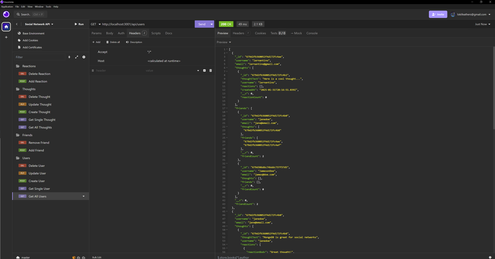
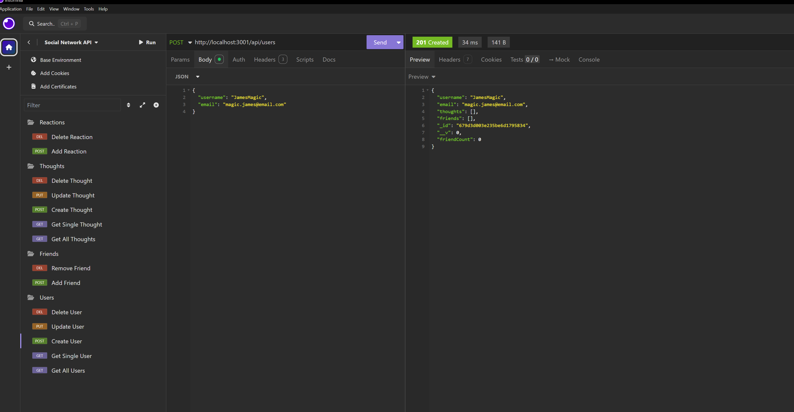
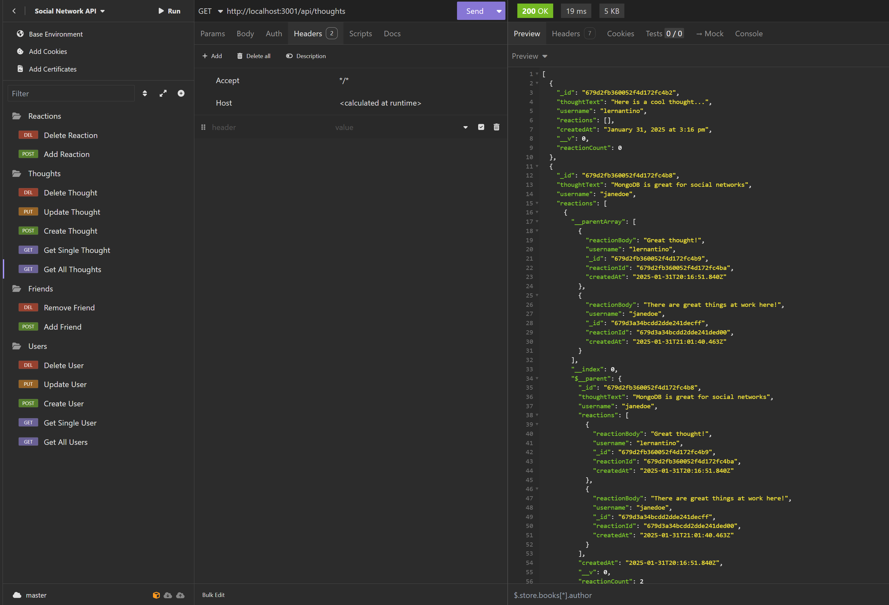
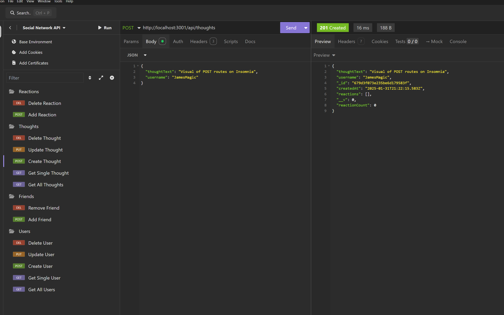
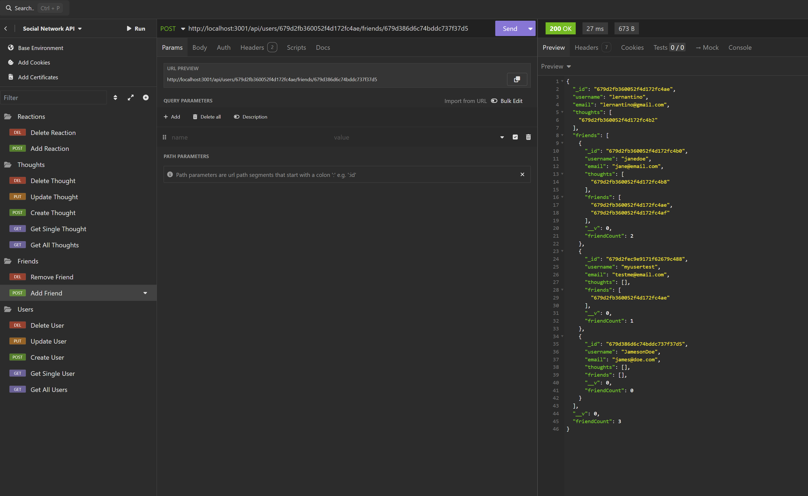
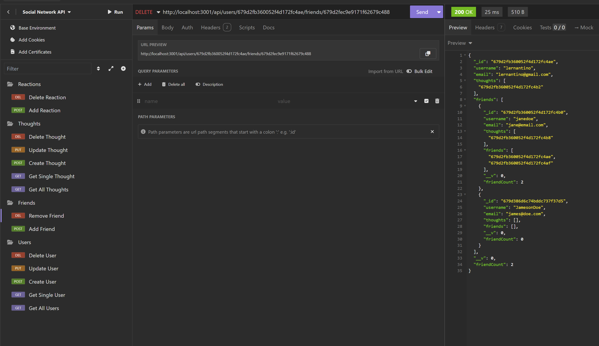
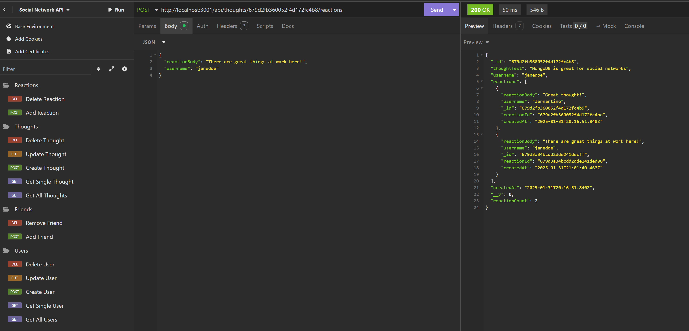
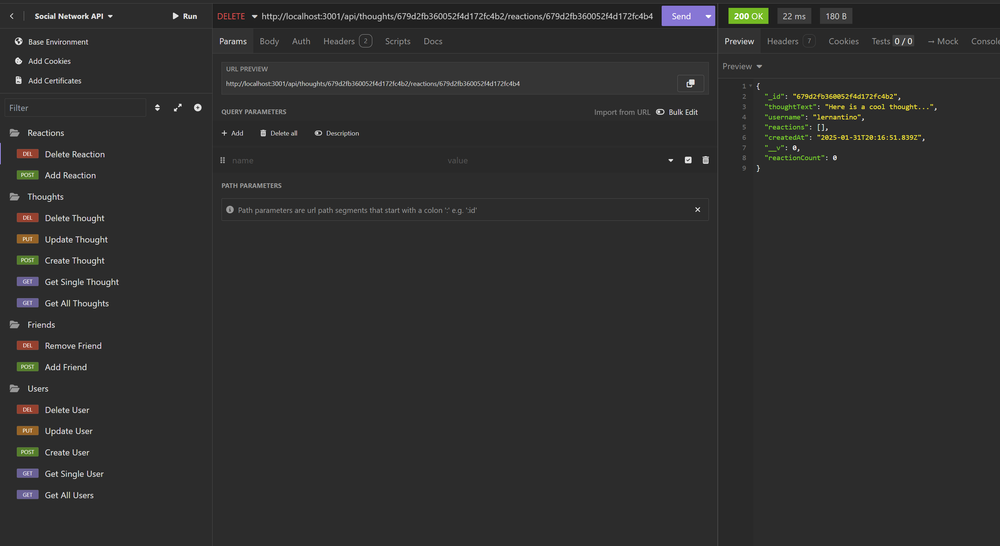

# Social Network API

A RESTful API for a social network web application where users can share thoughts,
react to friends' thoughts, and create a friend list. Built using Express.js,
MongoDB, and Mongoose ODM.

## Features

- User and Thought management with full CRUD operations
- Friend list management
- Reactions to thoughts
- Timestamp formatting
- MongoDB database with Mongoose ODM
- TypeScript implementation
- Error handling

## Installation

1. Clone the repository:

    ```bash
    git clone https://github.com/MadamLoki/socialAPI-mod17.git
    ```

2. Install dependencies:

    ```bash
    npm install
    ```

3. Configure environment variables:

    Create a `.env` file in the root directory and add:

    ```text
    MONGODB_URI=your_mongodb_connection_string
    ```

4. Build the TypeScript files:

    ```bash
    npm run build
    ```

## Usage

1. Start the server:

    ```bash
    npm start
    ```

2. For development with hot reload:

    ```bash
    npm run dev
    ```

3. Seed the database:

    ```bash
    npm run seed
    ```

## API Routes

### Users

- `GET /api/users` - Get all users
- `GET /api/users/:id` - Get user by ID
- `POST /api/users` - Create new user
- `PUT /api/users/:id` - Update user
- `DELETE /api/users/:id` - Delete user

### Friends

- `POST /api/users/:userId/friends/:friendId` - Add friend
- `DELETE /api/users/:userId/friends/:friendId` - Remove friend

### Thoughts

- `GET /api/thoughts` - Get all thoughts
- `GET /api/thoughts/:id` - Get thought by ID
- `POST /api/thoughts` - Create thought
- `PUT /api/thoughts/:id` - Update thought
- `DELETE /api/thoughts/:id` - Delete thought

### Reactions

- `POST /api/thoughts/:thoughtId/reactions` - Create reaction
- `DELETE /api/thoughts/:thoughtId/reactions/:reactionId` - Remove reaction

## Demo

> [Video Walkthrough](https://drive.google.com/file/d/1c6MMZOakkj3ZOEO-52-5FrYocVeMb8Ic/view?usp=sharing)

> [Insomnia Demo File](./assets/insomniatest.txt)
    - local test file only

## Technologies Used

- Node.js
- Express.js
- MongoDB
- Mongoose ODM
- TypeScript
- dotenv
- Insomnia

## Screenshots

### User Routes





### Thought Routes




### Friend Management




### Reaction Management



